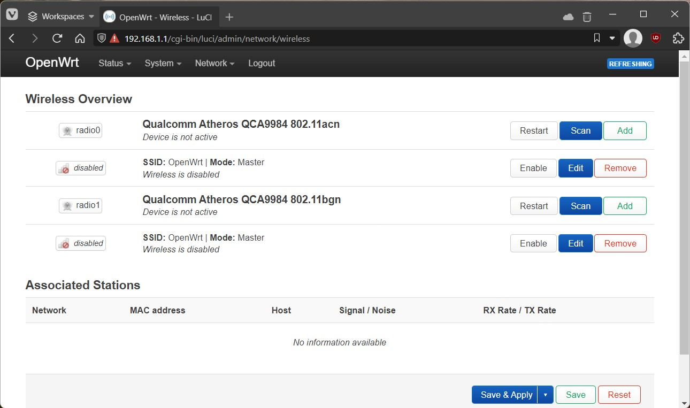

# Configuring OpenWrt with an essential Wi-Fi network
- [Configuring OpenWrt with an essential Wi-Fi network](#configuring-openwrt-with-an-essential-wi-fi-network)
  - [Log into your router running OpenWrt](#log-into-your-router-running-openwrt)
  - [Test and verify Internet connectivity](#test-and-verify-internet-connectivity)
  - [Setup Wi-Fi Access Point](#setup-wi-fi-access-point)

*If you don't have a Wi-Fi router running OpenWrt yet, then review [Installing OpenWrt on a Wi-Fi router](Installing-OpenWrt-on-a-Wi-Fi-router.md) guide first.*  

Now that you have OpenWrt running on a Wi-Fi router, the next step is to configure OpenWrt to create a Wi-Fi network so your client devices can connect to the Internet. By default, OpenWrt disables the Wi-Fi network for security, so you'll need to login to OpenWrt to change Wi-Fi settings.  

To do so, you'll need to complete these steps
1. Log into your router running OpenWrt
2. Test and verify internet connectivity
3. Setup Wi-Fi Access Point

The instructions below are for OpenWrt 22.03 version.

## Log into your router running OpenWrt
To log into your router, temporarily connect a wired ethernet cable from your computer to the `LAN` ethernet port on your router. Then in a web browser on your computer, navigate to http://192.168.1.1/ or http://openwrt.lan/ address to view the administration web site.  

You should see a login page like this:  

You'll see a reminder that no password is set by default. `root` is the default username for the administrator account in OpenWrt. You can set a  password for the `root` account after you login. Login with username `root` and no password.  

Now you should see the OpenWrt main status page that displays overview of router status.  

The next step is to set a password for the `root` administrator account. Go to to **System → Administration** page.  

 Enter a strong password in the "Password" field and repeat it in the "Confirmation" field, then select "Save" button to finalize changes. The next time you login to the Wi-Fi router, you'll need to enter this password.  

For more help, see [openwrt.org instructions](https://openwrt.org/docs/guide-quick-start/walkthrough_login)

## Test and verify Internet connectivity
Connect the wired ethernet cable from your internet modem or gateway to the `WAN` port on your router. OpenWrt by default creates a `LAN` internal wired network and bridges that network to the `WAN` internet behind a firewall.  
Temporarily connect a wired ethernet cable from your computer to the LAN ethernet port on your router, and open a web browser and verify your computer can access the Internet through OpenWrt.

For more help, see [openwrt.org Internet troubleshooting](https://openwrt.org/docs/guide-quick-start/checks_and_troubleshooting)

## Setup Wi-Fi Access Point
Temporarily connect a wired ethernet cable from your computer to the `LAN` ethernet port on your router and log into your router's OpenWrt administration web page.  

Next, go to **Network → Wireless** page.  

This page displays a list of wireless radio chips in your Wi-Fi router. Most routers will display 2 wireless radios, a 802.11ac (5Ghz Wi-Fi 5) and 802.11n (2.4GHz Wi-Fi 4).  

For each of your radios, you can create a Wi-Fi network by selecting `Add` button. You can use the same network name and password for both 802.11ac (5Ghz) and 802.11bgn (2.4GHz) Wi-Fi networks, and client devices will automatically connect to the best Wi-Fi network.  

1. For the first Wi-Fi network, in **Device Configuration** section, select **Advanced Settings** tab, then in **Country Code** menu, select the  country code that corresponds to the location of your OpenWrt router. This ensures your OpenWrt device meets the legal regulations in your country.  
2. For each Wi-Fi network, then configure related settings
   1. In **Interface Configuration** section and **General Setup** tab, in "ESSID" field, enter your network name. 
   2. In **Interface Configuration** section and **Wireless Security** tab, in "Encryption" menu, select your desired encryption type. `WPA2-PSK` is recommended for home/small office networks.
   3. In **Interface Configuration** section and **Wireless Security** tab, in "Key" field, enter the Wi-Fi password client devices use when connecting to the Wi-Fi network. 
   4. In **Device Configuration** section and **General Setup** tab, in  **Operating frequency**, set the **Channel** and **Width** to the best performance for your area. In general, for best performance in North America, choose these channel settings:     
        | Mode | Channel     | Width  |
        | ---- | ----------- | ------ |
        | N    | 1, 6, or 11 | 20 MHz |
        | AC   | 149         | 80 Mhz |
   5. Select "Save" button, then edit the settings for the next Wi-Fi network. 
   6. Select "Save & Apply" button to apply changes. 

Now on your client device, open Wi-Fi settings, find the new Wi-Fi network you created, and enter the Wi-Fi password, and connect to the network.

For more help, see [openwrt.org Enabling a Wi-Fi access point on OpenWrt](https://openwrt.org/docs/guide-quick-start/basic_wifi)