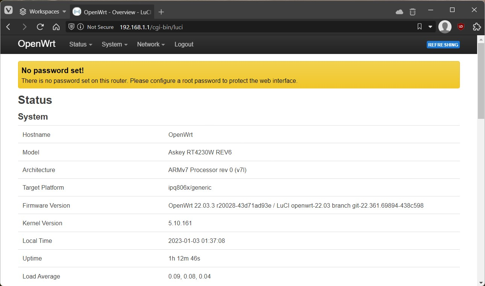

# Installing OpenWrt on a Wi-Fi router
Depending on the Wi-Fi router model, installing OpenWrt firmware could be as simple as using the Wi-Fi router's stock firmware upgrade web page and uploading the OpenWrt firmware, or as complex as disassembling Wi-Fi router to access the mainboard to flash OpenWrt firmware using serial or JTAG port.  
**Before buying a Wi-Fi router, review the instructions for installing OpenWrt to check the difficulty level and confirm you are comfortable with the level of difficulty involved.**  
- **Beginners** are recommended to select a Wi-Fi router that supports installing OpenWrt by using the Wi-Fi router's stock firmware upgrade web page, as that is the simplest installation method. 
- **Advanced users** can choose a Wi-Fi router that support installing OpenWrt via a command line interface to connect to the Wi-Fi router bootloader via wired ethernet connection, and setting up a TFTP server to transfer OpenWrt firmware.  

The below Wi-Fi routers are affordable and have good OpenWrt support as of 2023:
- [Dynalink DL-WRX36](https://openwrt.org/toh/dynalink/dl-wrx36) Wi-Fi 6 (802.11ax) 3600 Mbps max
- [Linksys E8450/Belkin RT3200](https://openwrt.org/toh/linksys/e8450) Wi-Fi 6 (802.11ax) 3200 Mbps max
- [Netgear R7800 Nighthawk X4S](https://openwrt.org/toh/netgear/r7800) Wi-Fi 5 (802.11ac) 2600 Mbps max
- [TP-Link TGR1900 (Google OnHub)](https://openwrt.org/inbox/toh/google/onhub_tp-link_tgr1900) Wi-Fi 5 (802.11ac) 1900 Mbps max

The instructions below were tested on OpenWrt 22.03 release.

## Installing OpenWrt firmware overview

1. Download the `factory.bin` OpenWrt firmware for your Wi-Fi router.
2. Flash your Wi-Fi router with the downloaded `factory.bin` OpenWrt firmware.

For detailed instructions, see https://openwrt.org/docs/guide-quick-start/factory_installation.  

## Log into your router running OpenWrt
To log into your router and change settings, temporarily connect a wired ethernet cable from your computer to the `LAN` ethernet port (not the *Internet/WAN* port) on your router. Then in a web browser on your computer, navigate to http://192.168.1.1/ or http://openwrt.lan/ address to view the OpenWrt admin web site.  

You should see a login page like this:  

You'll see a reminder that no password is set by default. `root` is the default username for the administrator account in OpenWrt. You can set a  password for the `root` account after you login. Login with username `root` and no password.  

Now you should see the OpenWrt main status page that displays overview of router status.  

The next step is to set a password for the `root` administrator account. Go to to **System → Administration** page.  

 Enter a strong password in the "Password" field and repeat it in the "Confirmation" field, then select "Save" button to finalize changes. The next time you login to the Wi-Fi router, you'll need to enter this password.  

For more detailed instructions, see [openwrt.org instructions](https://openwrt.org/docs/guide-quick-start/walkthrough_login)

## Test and verify Internet connectivity
Before configuring Wi-Fi network settings, first verify OpenWrt can connect to the Internet. Connect the wired ethernet cable from your internet modem or gateway to the `WAN` port of your OpenWrt Wi-Fi router. OpenWrt by default creates a `LAN` internal wired network and bridges that network to the `WAN` internet behind a firewall.  
Temporarily connect a wired ethernet cable from your computer to the LAN ethernet port on your router, and open a web browser and verify your computer can access the Internet through OpenWrt. 

For more detailed troubleshooting steps, see [openwrt.org Internet troubleshooting](https://openwrt.org/docs/guide-quick-start/checks_and_troubleshooting)

## Next step
After you've successfully installed OpenWrt firmware on a Wi-Fi router and verified internet connectivity, the next step is: [Configuring a Wi-Fi network in OpenWrt](Configuring-OpenWrt-with-essential-Wi-Fi-network.md)