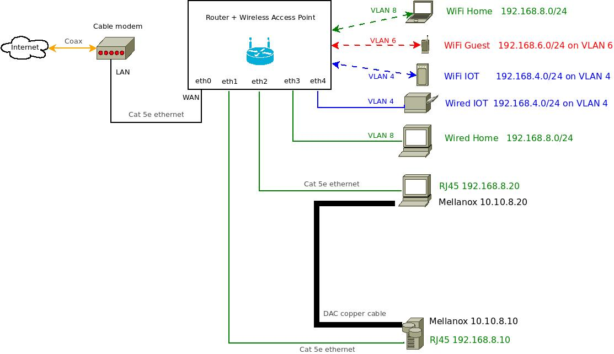
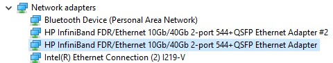
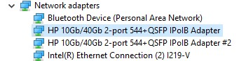
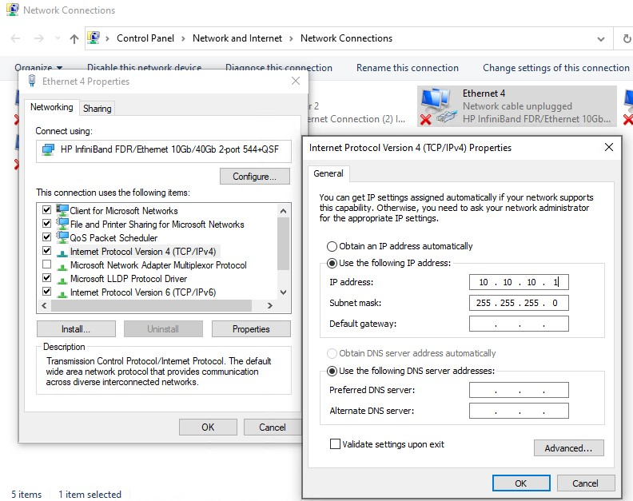
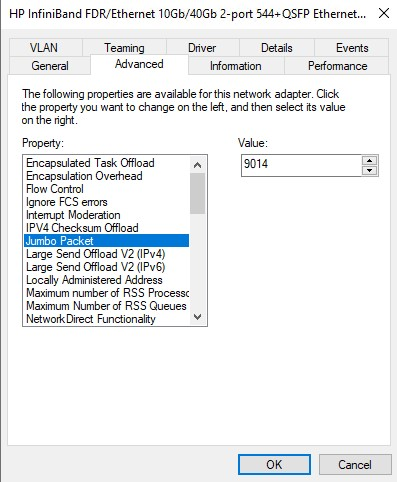

# Ultra-fast Local Network: 5 MB per second transfers with 40 Gbps point-to-point wired networking
- [Ultra-fast Local Network: 5 MB per second transfers with 40 Gbps point-to-point wired networking](#ultra-fast-local-network-5-mb-per-second-transfers-with-40-gbps-point-to-point-wired-networking)
  - [Hardware recommendations](#hardware-recommendations)
    - [40 Gbps (5 Megabytes per second)](#40-gbps-5-megabytes-per-second)
    - [10 Gbps (1.25 Megabytes per second)](#10-gbps-125-megabytes-per-second)
  - [Installing Mellanox drivers and configuration](#installing-mellanox-drivers-and-configuration)
    - [Linux](#linux)
    - [Windows 10/11](#windows-1011)
  - [Configuration](#configuration)
    - [Linux](#linux-1)
    - [Windows](#windows)
  - [Connect hardware cables](#connect-hardware-cables)
  - [Benchmarking network performance](#benchmarking-network-performance)
  - [Tuning for performance](#tuning-for-performance)
    - [Linux](#linux-2)
    - [Windows 10/11](#windows-1011-1)

A typical wired Ethernet network runs at 1 Gbps (Gigabit per second), equivalent to 125 Megabytes transfer per second. By upgrading to specialized network adapter hardware and cables, you can setup a wired network to transfer files at 10x (10 Gbps) or 40x (40 Gbps) speed of a 1 Gbps network between 2 or 3 desktop PCs for under $50 per device. No network switch is required, as PCs are connected directly to each other with a static IP addresses.  



## Hardware recommendations
Most desktop PCs produced in the last decade include a built-in 1 Gbps RJ45 LAN port commonly known as Gigabit Ethernet, 1 GbE, or 1000BASE-T. As of 2023, some newer high-end PCs include a built-in 2.5 GbE LAN port that supports transfers up to 2.5 Gbps (Gigabit per second).  
To transfer files at 40x speed of a 1 Gbps network, you'll need to upgrade to specialized network adapter hardware and cables. The lowest cost options start at under $50 for each device.  

### 40 Gbps (5 Megabytes per second)
PC requirements:
 - Windows 10/11 or Linux desktop PC with available PCIe 3.0 (PCI Express) x16 or PCIe 3.0 x8 physical slot and at least PCIe 3.0 x4 electrical connection. 
   - Mellanox network adapters designed for PCIe x8 cards will work in a PCIe x4 slot, but with slower performance. 

Cabling requirements:
 - Willing to use new twinax copper or fiber optic cables.

Recommended network adapter & cable sets:
 - Mellanox ConnectX-3 PRO (MCX354A-FCCT) network adapter: 2x 40 Gbps QSFP+ ports, PCIe 3.0 x8, 11W
 - For short cables < 16 ft (5 meters): Direct Attached Copper (DAC) twinax copper cable with QSFP plug (ex: NetApp 112-00177 5 meter cable)
 - For long cables, use fiber optic cables and the corresponding QSFP fiber optic transceiver.
 
### 10 Gbps (1.25 Megabytes per second)
If you want to use Ethernet cables, then you can choose the hardware below as a reference. *Note: this guide doesn't include driver or network configuration instructions.*  

PC requirements:
- Windows 10/11 or Linux desktop PC with available PCIe 2.0 (PCI Express) x16 or PCIe 2.0 x8 slot.  

Cabling requirements:
 - Have existing Cat6 ethernet cables or willing to use new Cat6 ethernet cables

Recommended network adapter & cable sets:
 - Intel X540-T2 (82599) network adapter: 2x 10 Gbps RJ45 ports, PCIe 2.1 x8, 13W
 - Cat6 ethernet cable
 - Cat6 cross-over adapter

## Installing Mellanox drivers and configuration
*These instructions apply to Mellanox ConnectX-3 and ConnectX-3 PRO network adapters.*

Install the Mellanox PCIe network adapter into an available PCIe 3.0 x8 slot on your PC. Then follow the instructions below that corresponds to the OS you're running.

### Linux
The Linux kernel in your distribution likely already includes Mellanox support. Verify Mellanox adapter is detected by running `lspci | grep Mellanox`, `dmesg | grep Mellanox`, `sudo ethtool <devicename>` and `ifconfig <devicename>`.

*Note:* Nvidia stopped releasing updates to Linux drivers for supporting Mellanox ConnectX-3 and Mellanox ConnectX-3 PRO series network cards on the latest Linux distribution releases. 

### Windows 10/11
1. Download [Windows driver (WinOF)](https://network.nvidia.com/products/adapter-software/ethernet/windows/winof-2/) for Mellanox ConnectX-3 and ConnectX-3 PRO network adapter cards.
2. Install drivers
3. Open Windows Device Manager, and in **Network Adapters**, verify the Mellanox adapter appears.

*Note:* Nvidia stopped releasing updates to Windows drivers for Mellanox ConnectX-3 and Mellanox ConnectX-3 PRO series network cards. Windows 10 drivers currently work fine on Windows 11.

## Configuration 
*Installing drivers is not enough. Follow these instructions for Mellanox ConnectX-3 and ConnectX-3 PRO network adapters to configure a network to use static local IPv4 addresses.*

### Linux
1. Configure the Mellanox adapter to use a static local IPv4 address since there is no DHCPv4 server because you're connecting 2 computers directly without a router or DHCP server.  
   1. Run `ifconfig` to identify the network adapter device id (ex: `enp1s0`)
   2. Run `sudo nano /etc/network/interfaces` to edit network configuration and add 
      ```
      auto enp1s0 
      iface enp1s0 inet static 
      address 10.10.10.1
      netmask 24
      ```
   3. To apply settings, disable and then reenable interface by running `sudo ifdown enp1s0 && sudo ifup enp1s0`
2. Edit `hosts` file on each PC.  
   Run `sudo nano /etc/hosts` to add new lines for each device using the below format. ex:   
   ```
   10.10.10.1  homeserver
   10.10.10.2  desktop
   ```

### Windows
1. Set the ports on Mellanox card to **Ethernet** mode instead of InfiniBand mode by running `mlxconfig -d mt4103_pci_cr0 set LINK_TYPE_P1=2 LINK_TYPE_P2=2`. Enter `y` to confirm the changes. Then reboot.  
   
   *Mellanox VPI cards support either InfiniBand or Ethernet modes, so you may need to change the card configuration to Ethernet mode.*  

   Ethernet mode:
   

   InfiniBand mode:
   

1. Configure the Mellanox adapter to use a static local IPv4 address since there is no DHCPv4 server because you're connecting 2 computers directly without a router or DHCP server.  
   1. Open **Network Connections** settings, find the Mellanox network adapter, then right click and select "**Properties**".
   2. In **Ethernet Properties** window, find and select **Internet Protocol Version 4 (TCP/IPv4)**, then select **Properties** button.
   3. Select "**Use the following IP address**:" and enter your local IPv4 address (ex: `10.10.10.2`), Subnet mask (ex: `255.255.255.0`), and leave Default gateway blank.
   
2. Edit `hosts` file on each PC.   
   Open `C:\Windows\System32\drivers\etc\hosts` file in text editor. At the end of the file, add new lines for each device. Ex:   
   ```
   10.10.10.1  homeserver
   10.10.10.2  desktop
   ```

## Connect hardware cables
Connect the QSFP+ plug in the Direct Attached Copper (DAC) twinax copper cable to the QFSP+ port on the network adapter cards. After a few seconds, the green LED on the network card will light up to indicated successful network activity.

## Benchmarking network performance
To test your network performance without being affected by HDD and SSD storage drive bottlenecks, use a network benchmark program like [iperf3](https://iperf.fr/iperf-download.php). 

1. Download and install [iperf3](https://iperf.fr/iperf-download.php) on both your server PC and client PC.
2. On your server PC, run `iperf3 -s`
3. On your client PC, run `iperf3 -c <server_ip_address>`
4. iperf3 running on your client PC will attempt to the server PC running iperf3 and run a network performance benchmark.

The benchmark results will look something like this: 

```
-----------------------------------------------------------
Server listening on 5201
-----------------------------------------------------------
Accepted connection from 10.10.8.13, port 56338
[  5] local 10.10.10.1 port 5201 connected to 10.10.10.2 port 56339
[ ID] Interval           Transfer     Bitrate
[  5]   0.00-1.00   sec  1.89 GBytes  16.2 Gbits/sec
[  5]   1.00-2.00   sec  1.98 GBytes  17.0 Gbits/sec
[  5]   2.00-3.00   sec  1.87 GBytes  16.0 Gbits/sec
[  5]   3.00-4.00   sec  1.97 GBytes  16.9 Gbits/sec
[  5]   4.00-5.00   sec  1.93 GBytes  16.6 Gbits/sec
[  5]   5.00-6.00   sec  1.96 GBytes  16.8 Gbits/sec
[  5]   6.00-7.00   sec  1.93 GBytes  16.6 Gbits/sec
[  5]   7.00-8.00   sec  2.03 GBytes  17.5 Gbits/sec
[  5]   8.00-9.00   sec  1.85 GBytes  15.9 Gbits/sec
[  5]   9.00-10.00  sec  1.97 GBytes  16.9 Gbits/sec
[  5]  10.00-10.05  sec  93.6 MBytes  16.1 Gbits/sec
- - - - - - - - - - - - - - - - - - - - - - - - -
[ ID] Interval           Transfer     Bitrate
[  5]   0.00-10.05  sec  19.5 GBytes  16.6 Gbits/sec                  receiver
```

## Tuning for performance

### Linux
1. Configure Mellanox adapter's maximum size of a frame (packet) to `9000` by setting **MTU** (Maximum Transmission Unit) to `9000` instead of default `1514`.
   1. Run `sudo nano /etc/network/interfaces` to edit network configuration and add `mtu 9000` line to your network adapter configuration. Ex:
      ```
      auto enp1s0 
      iface enp1s0 inet static 
      address 10.10.10.1
      netmask 24 
      mtu 9000
      ```

### Windows 10/11
1. Configure Mellanox adapter's maximum size of a frame (packet) to `9014`. 
   1. Open **Network Connections** settings, find the Mellanox network adapter, then right click and select "**Properties**".
   2. Select **Configure** button
   3. In the adapter properties window, select **Advanced** tab, then select "**Jumbo Packet**", and then change value to `9014` instead of the default `1514`.
   